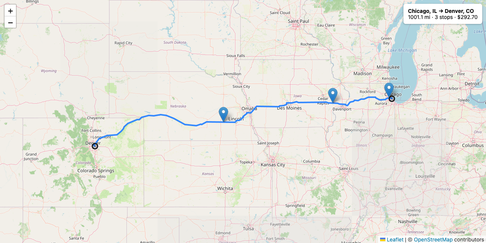
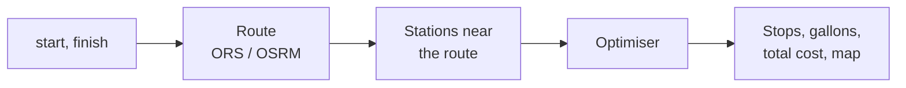
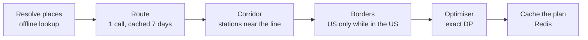
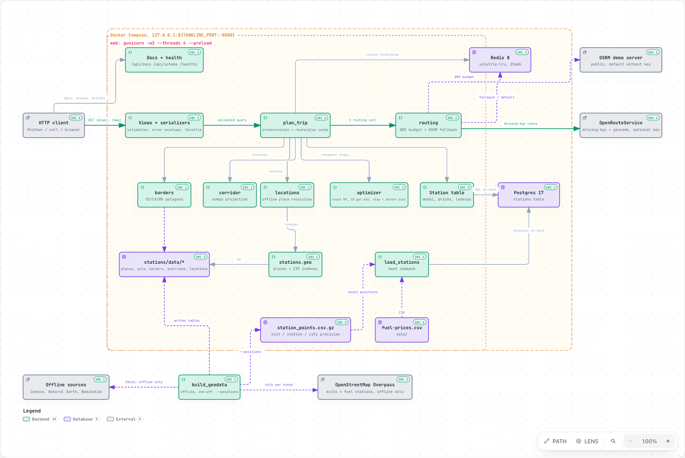
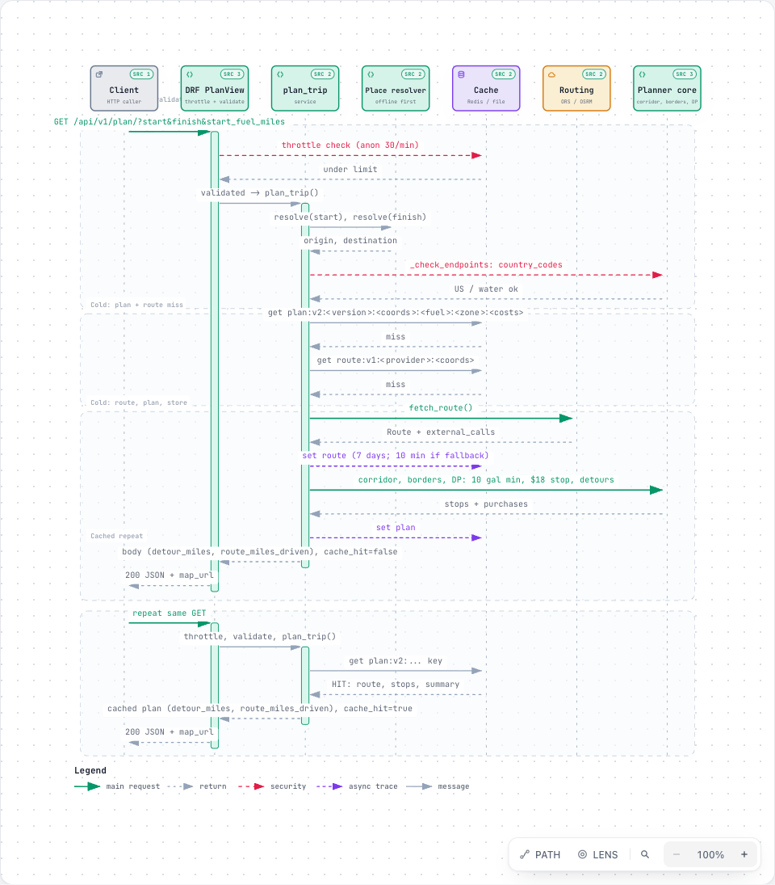
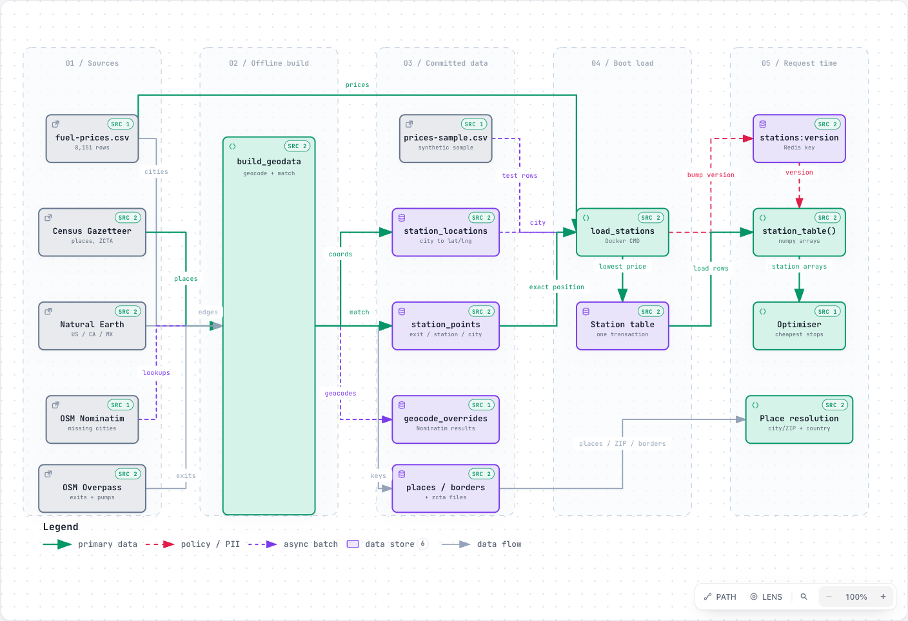
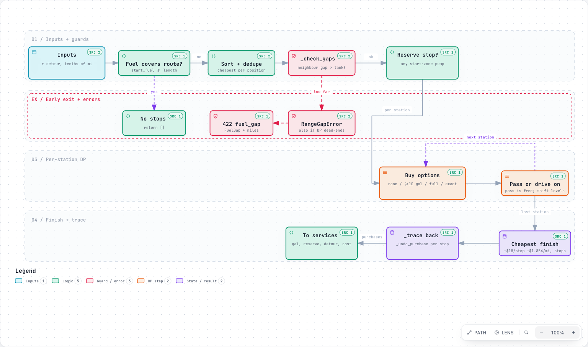

# tankline

[](https://github.com/parthsarkhelia/tankline/actions/workflows/ci.yml)

[](https://github.com/astral-sh/ruff)


**Where should a truck buy diesel between two US cities?** Give tankline a start and a finish; it returns
the truck route, the cheapest realistic fuel stops, how much to buy at each, and the total fuel bill,
with a map.



## What it does

- **Route**: one call to OpenRouteService (truck profile), or the public OSRM server when there is no key.
- **Stops**: picks pumps from ~6,700 priced US and Canadian truck stops within a few miles of the route.
- **Cost**: an exact optimiser for a truck with a 500-mile range (50 gal, 10 mpg), cheapest fuel first.



## Quick start

```bash
git clone https://github.com/parthsarkhelia/tankline && cd tankline
docker compose up --build
open "http://localhost:8000/map/?start=Chicago,%20IL&finish=Denver,%20CO"
```

> [!NOTE]
> No API key or `.env` is needed. The container migrates Postgres, loads the stations and starts gunicorn with Redis for caching. Health: `/healthz`, interactive docs: `/api/docs/`.

Optional settings (`cp .env.example .env`):

| Variable | Default | Effect |
| --- | --- | --- |
| `ROUTING_PROVIDER`, `ORS_API_KEY` | `osrm`, empty | Set `ors` and a free key for truck routing (`driving-hgv`). |
| `TANKLINE_PORT` | `8000` | Host port, if 8000 is taken. |
| `STOP_COST_USD` | `18` | Time cost of one stop; `0` gives the pure cheapest-fuel plan. |
| `DETOUR_COST_PER_MILE_USD` | `1.854` | Cost of each mile driven off the route to a pump. |

<details>
<summary>Run without Docker (SQLite, no Redis)</summary>

```bash
cp .env.example .env
uv sync
uv run --env-file .env manage.py migrate
uv run --env-file .env manage.py load_stations
uv run --env-file .env manage.py runserver
```

</details>

## Try it

```
GET /api/v1/plan/?start=Chicago, IL&finish=Denver, CO&start_fuel_miles=0
```

Places can be `City, ST`, a ZIP code or `lat,lng`. Trimmed response:

```json
{
  "route": { "distance_miles": 1001.1, "duration_hours": 22.9, "profile": "driving-hgv" },
  "fuel_stops": [
    { "stop": 1, "name": "QUIKTRIP #7208", "city": "Bellwood", "state": "IL", "mile": 12.5,
      "price_per_gallon": "3.079", "gallons": "19.81", "cost": "61.06",
      "detour_miles": 0.4, "location_precision": "exit" },
    { "stop": 2, "name": "KUM & GO #0267", "city": "Tipton", "state": "IA", "mile": 197.7, "...": "..." },
    { "stop": 3, "name": "AKAL TRAVEL CENTER", "city": "Waco", "state": "NE", "mile": 557.9, "...": "..." }
  ],
  "summary": { "stops": 3, "gallons_purchased": "100.23", "total_cost": "292.70" },
  "meta": { "external_calls": 0, "cache_hit": true, "elapsed_ms": 12 },
  "map_url": "http://localhost:8000/map/?start=Chicago%2C+IL&finish=Denver%2C+CO&start_fuel_miles=0"
}
```

| Field | Meaning |
| --- | --- |
| `mile` | Distance from the start along the route. |
| `gallons`, `cost` | Bought at this stop; `total_cost` is fuel money only. |
| `detour_miles` | Estimated drive from the route to the pump and back. |
| `location_precision` | `exit` or `station` (matched in OpenStreetMap) or `city` (city centre only). |
| `external_calls`, `cache_hit` | A repeated request is served from cache with no outside call. |

Every field, parameter and error code: [docs/api.md](docs/api.md). A Postman collection is in `postman/`.

## How it works



1. **Resolve**: `City, ST`, ZIP and coordinates are looked up in committed Census data; only other free text is geocoded.
2. **Route**: OpenRouteService `driving-hgv`, falling back to OSRM on quota, timeout or error.
3. **Corridor**: stations are projected onto the route with numpy; kept within 5 miles (exit or pump) or up to 20 miles (city-level).
4. **Borders**: Canadian stations count only where the route itself is in Canada.
5. **Optimiser**: dynamic programming over the fuel level in tenths of a mile, checked against brute force in the tests.
6. **Cache**: routes and plans live in Redis, keyed by the station data version and the cost settings.

| [](docs/diagrams/architecture.html) | [](docs/diagrams/request-sequence.html) | [](docs/diagrams/station-data.html) | [](docs/diagrams/optimiser.html) |
| :---: | :---: | :---: | :---: |
| Architecture | Request sequence | Station data | Optimiser |

The diagrams are interactive HTML; download and open them in a browser. Design notes with measurements: [docs/design.md](docs/design.md).

### What "optimal" means

**Plan cost = fuel + $18 per stop + $1.854 per detour mile.** The two extra terms come from ATRI's
published truck operating costs ([derivation](docs/design.md#optimiser)). They only choose the plan;
`total_cost` stays fuel money. Without them the cheapest plan stops for a gallon and a half just after a fill:

| New York to Los Angeles | Stops | Smallest fill | Fuel bill |
| --- | --- | --- | --- |
| Fuel cost only (`STOP_COST_USD=0`) | 16 | 1.28 gal | $852.67 |
| With the $18 stop cost | 7 | 18.53 gal | $860.10 (+0.9%) |

## Assumptions

| Topic | Assumption | Change it |
| --- | --- | --- |
| Truck | 500-mile range, 10 mpg, 50 gal tank. | `VEHICLE_RANGE_MILES`, `VEHICLE_MPG` |
| Start | Empty tank; the first fill is at a station in the start city. | `start_fuel_miles` |
| Fill | At least 10 gal per stop, unless filling to full or the final top-up. | `VEHICLE_MIN_FILL_GALLONS` |
| Prices | USD per gallon from `data/fuel-prices.csv`; lowest price per station. | replace the CSV |
| Detours | 1.3 × straight-line distance each way, min 0.2 mi (1 mi at city level). | `DETOUR_COST_PER_MILE_USD` for the cost |
| Borders | No border crossing just for cheaper diesel. | none |

## Limitations

> [!WARNING]
> - **Prices are a snapshot**, not live; station positions are an OpenStreetMap snapshot from 2026-09-30.
> - **About a third of stations are at city level**: their position and detour are estimates.
> - **Detours are straight-line estimates**, not routed.
> - **No tolls, hours of service, traffic, opening hours or brand preferences.**
> - **Without an ORS key, routing uses OSRM's car profile**, so durations are shorter than a truck's.
> - **A stretch with no station within 500 miles** returns `422 fuel_gap`.

## Performance

Docker Compose on an Apple Silicon laptop, real price list.

| Request | Time |
| --- | --- |
| New York to Los Angeles, first request (1 routing call) | 1.0 to 1.5 s, mostly the routing provider |
| Same trip, route cached, new plan | 60 to 105 ms |
| Same request again (cached plan) | 1 to 12 ms |

<details>
<summary>Development</summary>

```bash
uv run pytest                 # synthetic stations, recorded routes, network blocked
uv run ruff check . && uv run ruff format --check . && uv run pyright
uv run pylint config planner stations tests
uv run --env-file .env manage.py build_geodata --positions   # rebuild exit/station positions (Overpass)
uv run --env-file .env manage.py warm_routes                 # cache the Postman demo routes
```

CI runs ruff, pyright, pylint and pytest on every push. Test coverage is 81% overall and about 96% for
the code that serves requests; the rest is the offline data build, which needs the network.

The free OpenRouteService key allows 200 truck routes a day; `ORS_DAILY_BUDGET` (default 150) caps
tankline's use, after which OSRM answers.

</details>

<details>
<summary>Data sources and credits</summary>

- Fuel prices: `data/fuel-prices.csv`, a retail diesel price list of US and Canadian truck stops.
- Exits and fuel stations: © OpenStreetMap contributors, ODbL (Overpass and Nominatim).
- City and ZIP coordinates: US Census Gazetteer. Country borders: Natural Earth.
- Operating costs: American Transportation Research Institute (ATRI), cited in [docs/design.md](docs/design.md).

</details>
